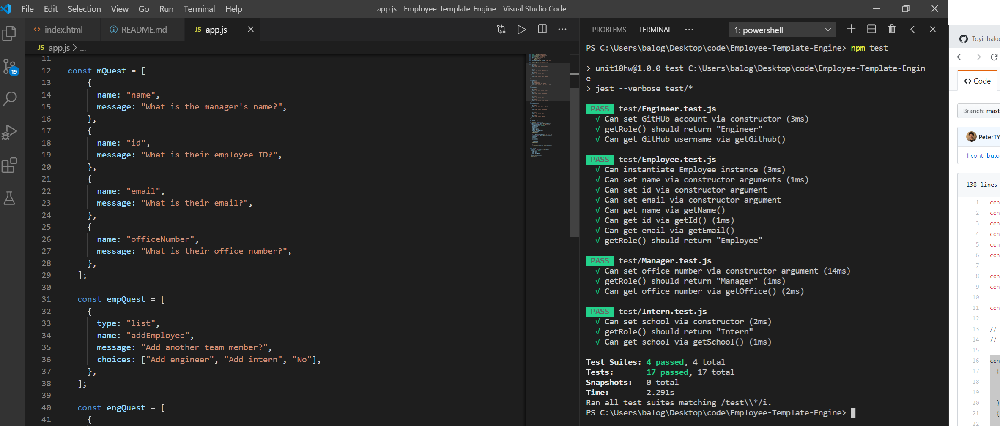
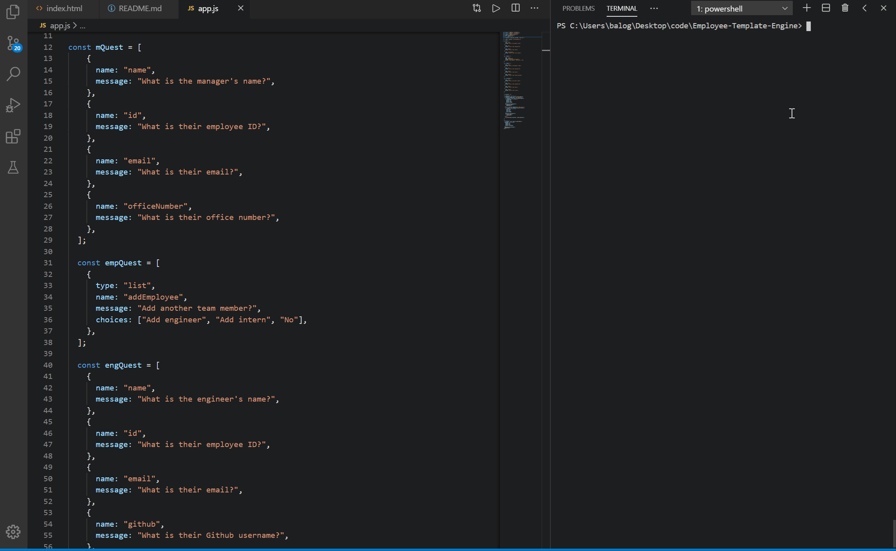
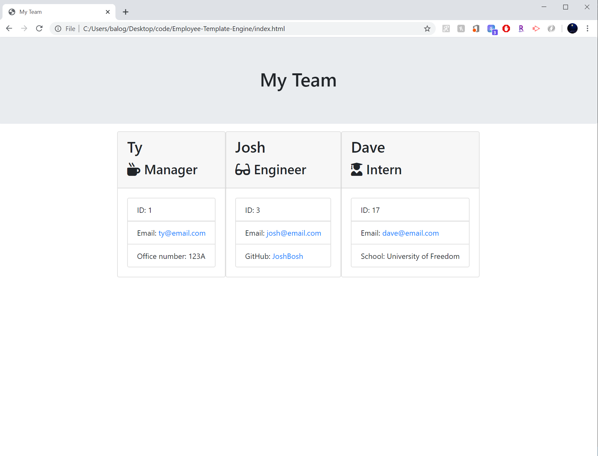

# Employee-Template-Engine
# Description

# Table of Contents
1. [Installation](#Installation)
2. [Usage](#Usage)
3. [Test](#Test)
4. [Demo](#Demo)
5. [Team-Output](#Team-Output)
6. [Questions](#Questions)

# Installation
Install the following npm modules:
- "jest": "^24.9.0"
- "inquirer": "^6.5.2

# Usage
1. Enter this comand: node app.js
2. Answer the prompted questions and add as many team members as you would like.
3. Team would be generated on 'index.html file'

# Test

# Demo

# Team-Output

# Questions
Email: balogunt302@gmail.com